# 2019.2-tubodeventuri

# Tema Escolhido: Experimento do Tubo de Venturi

# 1. Início

# Integrantes

1 - Ludimila S. Ferreira - 12/0126834

2 - Mayra Carolina - 17/0053059

3 - Rafael Carvalho - 12/0040328

# Introdução

O efeito Venturi, conhecido como tubo de Venturi, ocorre quando num sistema fechado, um fluido em movimento constante dentro de um duto uniforme, comprime-se momentaneamente ao encontrar uma zona de estreitamento, na qual ocorre a queda da pressão e consequentemente o aumento da sua velocidade. Se neste ponto, um terceiro duto ou uma sonda for introduzido, ocorrerá uma sucção do fluido contido nessa ligação. Este efeito, demonstrado em 1797, recebe o nome do físico italiano Giovanni Battista Venturi.

O efeito Venturi é explicado pelo Princípio de Bernoulli e o Princípio da Continuidade de Massa. Se o fluxo de um fluido é constante, mas sua área de escoamento diminui, então necessariamente sua velocidade aumenta. Pelo teorema da conservação da energia, se a energia cinética aumenta, a energia determinada pelo valor da pressão diminui obrigatoriamente.
A vazão pode ser determinada a partir do escoamento de um fluido através de determinada seção transversal de um conduto livre (canal, rio ou tubulação aberta) ou de um conduto forçado (tubulação com pressão positiva ou negativa). Isto significa que a vazão representa a rapidez com a qual um volume escoa.

# Objetivo

Este experimento tem o intuito de medir a **velocidade** e a **vazão** de um fluxo de um fluido incompressível, através da variação da pressão durante a passagem deste fluido por um tubo de seção mais larga e depois por outro de seção mais estreita, sendo estes efeitos explicados pelo Princípio de Bernoulli e pelo o Princípio da Continuidade de Massa.

# Requisitos de Solução

- Avaliação de possíveis soluções para cumprir os objetivos do sistema:i

Para a parte experimental do tubo de Venturi, uma possível solução será a construção de um protótipo de túnel de vento acoplado a um manômetro de altura de forma parecida a imagem mostrada abaixo. O protótipo foi tomado como solução devido ao fato da indisponibilidade do túnel de vento presente no Laboratório de Termofluidos da FGA.

Com o experimento, será determinado a velocidade de saída e a vazão analizando o valor final do manômetro de altura.

# Considerações para a Solução

Primeiramente, para conseguirmos todas as medições necessárias para que os objetivos se concretizem, adotaremos certas condições simplificadoras:

1. Escoamento permanente;
2. Escoamento incompressível;
3. O escoamento será tomado ao longo de uma linha de corrente;
4. Desprezar o atrito;
5. Tubulação disposta horizontalmente.

As equações básicas que serão usadas para alcançar as soluções serão:

1. Equação de Continuidade;
2. Equação de Bernoulli;
3. Equação de Vazão;
4. Teorema de Stevin.

Informações adicionais serão:

1. Área da seção transversal do tanque;
2. Durante o experimento, a variação de altura do fluido no tubo será determinada.

# Escopo do Experimento

- Estabelecimento de tarefas necessárias para a execução do experimento:

A primeira etapa consiste em aprofundar a base teórica sobre o funcionamento do tubo de Venturi, e sobre os fenômenos físicos a serem estudados, a partir dos princípios de Bernoulli, e da Continuidade de Massa. A etapa seguinte consiste no planejamento, na definição dos materiais a serem utilizados, e na construção do tubo em si. As últimas etapas consistem no levantamento de dados e variáveis para os cálculos a serem realizados, e por fim a realização do experimento no Laboratório de Termofluidos.

# Avaliação de Viabilidade

O experimento escolhido pelo grupo é viável pois nas dependências da faculdade há um túnel de vento com manômetros de altura, disponíveis para uso no Laboratório de Termofluidos. Entretanto, também podemos construir um tubo de Venturi de forma simplificada, utilizando garrafa pet, secador de cabelo, fluido previamente determinado de preferência não viscoso, e argamassa.
Estima-se que após o levantamento teórico do tema, levaremos 2 semanas para a confecção do tubo de Venturi, e execução do experimento.

# 2. Planejamento e Preparação

# Procedimentos Experimentais

- Estimativa do tempo necessário para a montagem e execução do procedimento:

O tempo estimado para a realização do experimento será de duas semanas, nas quais serão feitas a montagem do tubo de Venturi, e o agendamento para a utilização do Laboratório de Termofluidos para a execução do experimento, tendo o tempo estimado de 2 horas para a conclusão deste.

### Responsabilidades dos Membros

1. Aquisição dos itens: Rafael;
2. Montagem do experimento: Todos;
3. Execução do experimento: 
* Procedimento: Ludimila, Rafael; 
* Coleta de dados: Mayra.

### Cronograma

|    Datas    |               Atividades               |   
|-------------|----------------------------------------|
|09/09 - 13/09|Levantamento de dados                   |  
|16/09 - 27/09|Montagem e execução do experimento      |   
|30/09 - 23/11|Cálculos e elaboração do relatório final|  

# Dados a Serem Medidos e/ou Calculados

O tubo de Venturi ou medidor de Venturi é um aparato criado para medir a velocidade e a vazão do escoamento
de um fluido incompressível, através da variação da pressão durante a passagem deste fluido por um tubo de seção
mais larga e depois por outro de seção mais estreita. Este efeito é explicado pelo Princípio de Bernoulli e Princípio da Continuidade de Massa. Se o fluxo de um fluido é constante, mas sua área de escoamento diminui, então necessariamente sua velocidade aumenta. Para o teorema da conservação da energia, se a energia cinética aumenta, a energia determinada pelo valor da pressão diminui.

Vazão (Q) é o volume de determinado fluido que passa por uma determinada seção de
um conduto livre ou forçado, por unidade de tempo. Sendo assim, a rapidez com
que um volume escoa pode ser dada pelas equações:

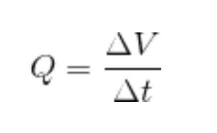

(Variação de volume sobre variação do tempo)

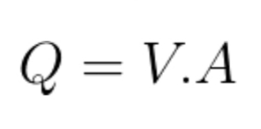

(Área da seção vezes volume)

As propriedades do escoamento que descrevem o seu comportamento podem ser determinadas a partir da Equação de Bernoulli. Para aplicar essa equação, o escoamento deve ser considerado incompreensível, em regime permanente, ao longo de uma linha de corrente e invíscido.

Os termos da Equação são:

V = velocidade do fluido ao longo do duto
g = aceleração da gravidade
h = altura em relação a um referencial
P = pressão do fluido 
ρ = massa específica do fluido

A variação de pressão pode ser calculada pelo Teorema de Stevin:

   
Os dados a serem medidos compreendem as dimensões do tubo, as áreas da seção do escoamento, e a variação de altura do fluido. A partir desses dados, será possível obter os valores referentes à velocidade, vazão do escoamento e variação de pressão.

# Resultados Esperados

Os resultados esperados correspondem à variação de pressão do fluido, e consequentemente, à determinação da velocidade e da vazão do escoamento.

# 3. Execução

# Divisão de Tarefas

A divisão de tarefas permanece a mesma descrita na etapa 2. A montagem do experimento será realizada por todos os membros. A execução será dividida em duas tarefas: a realização do procedimento experimental, e a coleta de dados.

1. Aquisição dos itens: Rafael;
2. Montagem do experimento: Todos;
3. Execução do experimento: 
* Procedimento: Ludimila, Rafael; 
* Coleta de dados: Mayra.

# Descrição dos Procedimentos Realizados

### Montagem

**1. Materiais Utilizados**

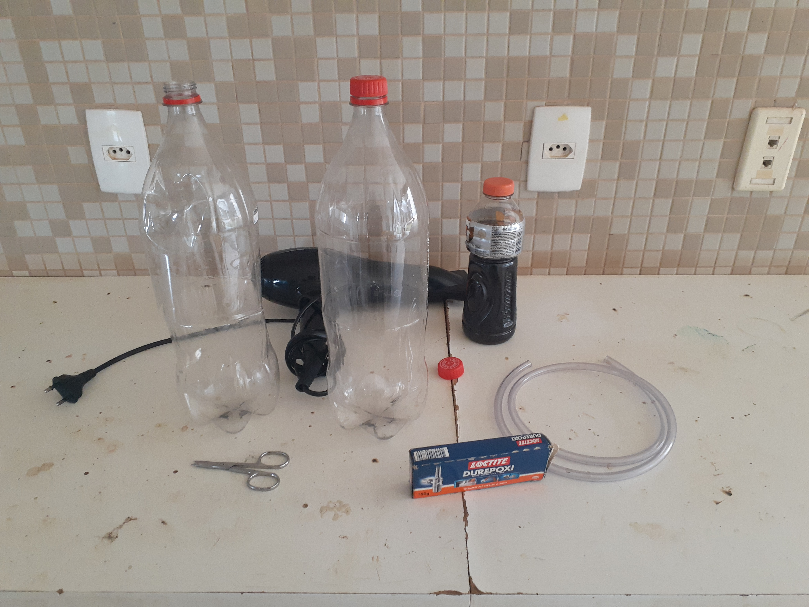

- 2 garrafas PET
- 1 mangueira
- durepoxi
- tesoura
- fita isolante
- fita adesiva
- seringa
- 2 caixas de papelão 
- 3 ml de refrigerante
- 1 secador de cabelo **Gamma Eleganza 2200**

**2. Confecção do Tubo**

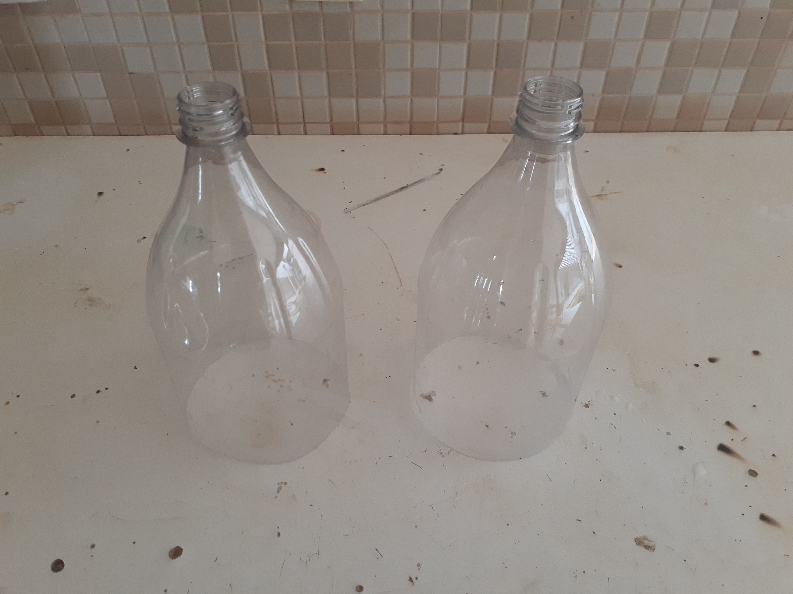

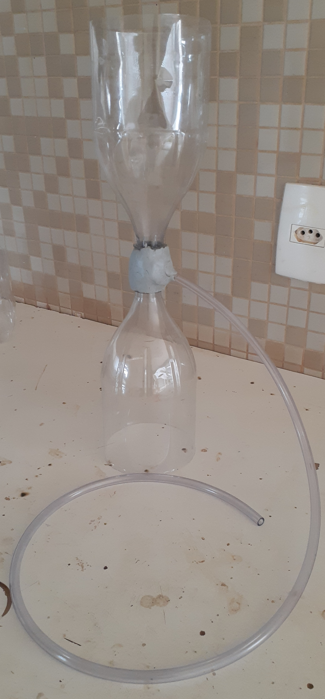

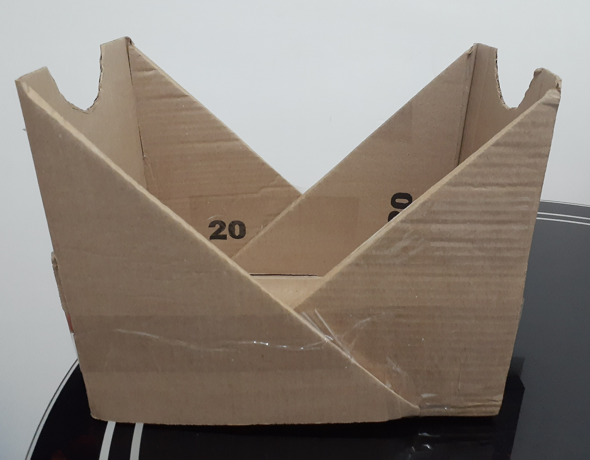

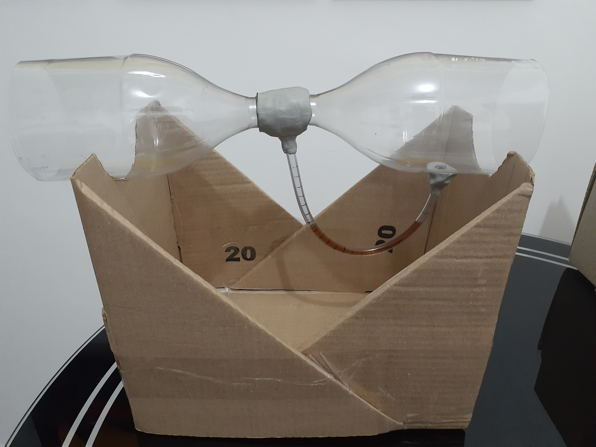

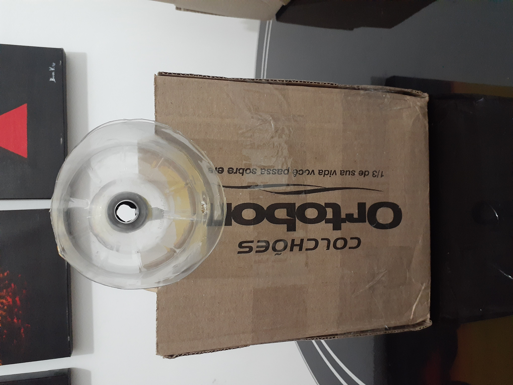

### Execução

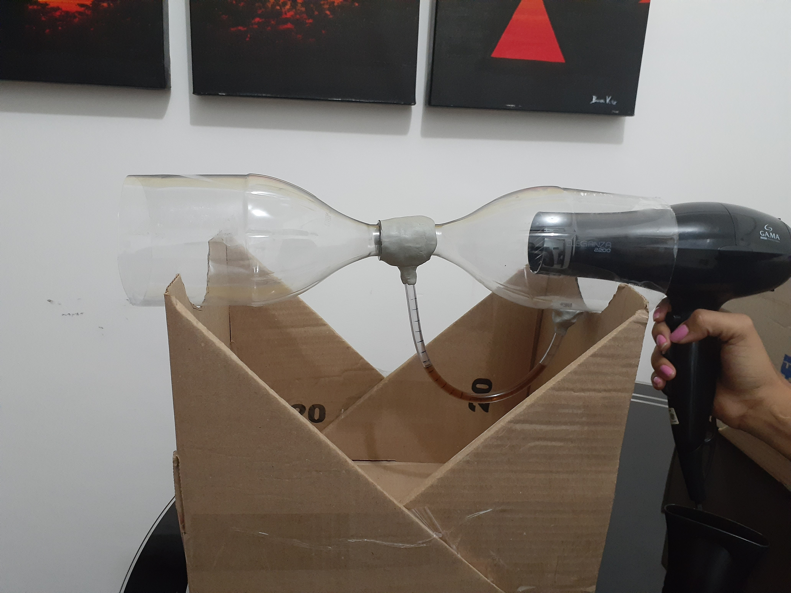

### Dados Medidos

| Dimensões              |   (m)   |  
|------------------------|---------|
|Diâmetro maior (A1)     |  0,108  |  
|Diâmetro menor (A2)     |  0,025  |              
|Diâmetro da mangueira   |  0,005  |
|Comprimento da mangueira|  0,270  |   
 
|  Áreas  |   (m²)   |   
|---------|----------|
|   A1    |  0,0092  |   
|   A2    |  0,0005  |   

| Volume do fluido  | Variação da altura do fluido (H) |   
|-------------------|----------------------------------|
|      0,3 ml       |             0,005 m              |   

# 4. Análise e Conclusão

# Resultados

Os dados obtidos experimentalmente foram utilizados para a realização dos cálculos da variação de pressão do fluido, da vazão do escoamento e das velocidades ao longo das seções do tubo. Dois pontos ao longo de uma linha de corrente foram considerados, sendo o primeiro (ponto 1) localizado na seção de área A1 e o segundo (ponto 2) na seção de área A2. Com isso, os termos relacionados a energia potencial e variação de altura no escoamento puderam ser cancelados, uma vez os pontos 1 e 2 possuem a mesma altura:

                                                 h1 = h2

A partir da Equação da Continuidade foi possível obter uma relação para as duas velocidades nos pontos 1 e 2:

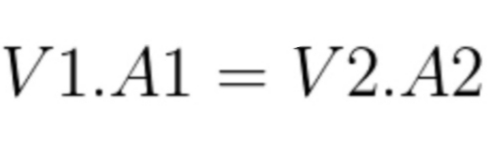

(A1/A2) V1 = V2

(A1/A2) = (0,0092/0,0005) = 18,4

**18,4 V1 = V2**

Com as condições simplificadoras, a equação de Bernoulli pôde ser aplicada, tomando a seguinte forma:

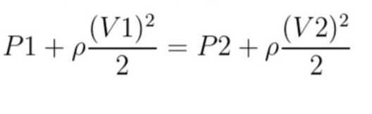

Substituindo a relação encontrada a partir da equação da Continuidade na equação de Bernoulli, obtém-se a expressão para a velocidade:

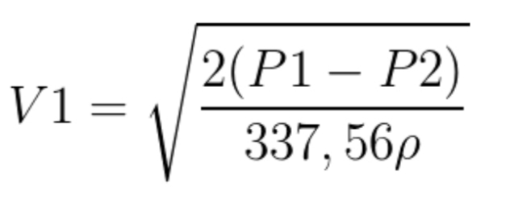

A diferença de pressão ∆P pode ser obtida através do Teorema de Stevin, uma vez que a variação da altura da coluna de fluido H foi obtida:

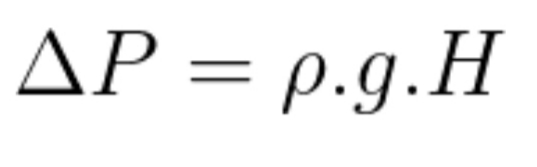

H = 0,005 m

g = 9,8 m/s

ρ(ar) = 1,1839 kg/m³ (Temperatura ambiente)

**∆P = 0,058 Pa**

Substituindo esse resultado na expressão para a velocidade, obtém-se os valores:

**V1 = 0,0170 m/s**

**V2 = 0,3135 m/s**

A partir das velocidades, a vazão nas seções A1 e A2 é obtida:

Q =  V1 . A1 = V2 . A2 

**Q = 0,0002 m³/s**

# Comparação dos Resultados com a Teoria Envolvida

Segundo (Schneider, 2003) o tubo de Venturi é o medidor com o melhor desempenho
entre os seus similares, na categoria de medidores de obstrução, o que evidenciou-se durante 
os testes por sua relativa simplicidade, além de ser o medidor 
que provoca a menor perda de carga permanente na medida, portanto o menos intrusivo.
A imagem localizada na parte de execução deste documento apresenta uma construção típica desse instrumento,
onde assim como na teoria, temos a entrada em cone convergente e a saída em cone divergente.

Diante disso chegamos ao resultado esperado na qual pôde-se encontrar a velocidade
do escoamento e por conseguinte a vazão volumétrica de forma indireta, utilizando-se variáveis físicas 
geradas pelo fluido, no caso a pressão e a velocidade. Acelerando-se o fluido para que sua pressão caia temporariamente.

Os resultados acima demonstrados no capítulo 4, coincidem com o esperado da teoria
Assim como na teoria é considerado o fluido ideal onde a velocidade é constante,
não apresenta viscosidade e considerou-se o escoamento estacionário, 
(escoamento constante ao longo do tempo).

# Conclusão
O Tubo de Venturi é um medidor de vazão com qual podemos verificar mudanças de velocidade e pressão dentro do tubo.
O aumento de energia cinética no fluído é compensado pela perda de pressão, isto sendo explicado pela conservação de energia.
Através do sucesso do experimento realizado, obteve-se a altura(H) para que fosse possível  o cálculo da vazão e velocidade, presentes no ensaio.

Com o método analítico chega-se ao resultado de vazão volumétrica igual a 
Q = 0,0002 m³/s, variação de pressão igual a ∆P = 0,058 Pa e velocidades V1 = 0,0170 m/s e V2 = 0,3135 m/s 
A utilização do tubo de Venturi é amplamente empregada na indústria e na medicina como exemplo : Sistema Circulatório, extintores, carburadores, dentre outras aplicações.

# Bibliografia

@misc{
title = {Tubo de Venturi caseiro e equação de Bernoulli.};
url = {https://www.youtube.com/watch?v=R1kjfHtl9xc&t=71s};
urlacessdate = {31 set 2019};
}

@misc{
title = {“Apostilas e Material de Aula”, Escola de Engenharia –
UFRGS} ;
url = {http://www.mecanica.ufrgs.br/disciplinas};
urlacessdate = {2007-2}};
}
